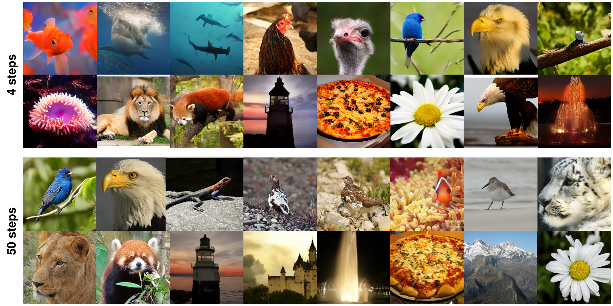

<div align="center">

# Improved Distributional Diffusion Models
<sub>Official PyTorch Implementation</sub>

<p>
  <a target="_blank" href="https://scholar.google.com/citations?user=3HCXNX4AAAAJ">Tommaso Martorella</a><sup>1,2</sup> &nbsp;·&nbsp;
  <a target="_blank" href="https://scholar.google.com/citations?user=kIpoNtcAAAAJ">Alexandre Galashov</a><sup>3,4</sup> &nbsp;·&nbsp;
  <a target="_blank" href="https://scholar.google.com/citations?user=2Il9dwMAAAAJ">Felix Krause</a><sup>1,2</sup> &nbsp;·&nbsp;
  <a target="_blank" href="https://scholar.google.com/citations?user=egzbdnoAAAAJ">Stefan Andreas Baumann</a><sup>1,2</sup>
  <br>
  <a target="_blank" href="https://scholar.google.com/citations?user=dn_F9I4AAAAJ">Valentin De Bortoli</a><sup>3</sup> &nbsp;·&nbsp;
  <a target="_blank" href="https://scholar.google.com/citations?user=OUv7J6QAAAAJ">Arthur Gretton</a><sup>3,4</sup> &nbsp;·&nbsp;
  <a target="_blank" href="https://scholar.google.com/citations?user=zWbvIUcAAAAJ">Björn Ommer</a><sup>1,2</sup>
</p>
<p>
  <sup>1</sup>CompVis @ LMU Munich &nbsp;&nbsp; <sup>2</sup>Munich Center for Machine Learning (MCML)
  <br>
  <sup>3</sup>Google DeepMind &nbsp;&nbsp; <sup>4</sup>Gatsby Unit @ UCL
</p>

<a target="_blank" href="https://arxiv.org/abs/XXXX.XXXXX"></a>
<a target="_blank" href="https://compvis.github.io/iDDM"></a>
<a target="_blank" href="https://huggingface.co/CompVis/iDDM"></a>
<a href="LICENSE"></a>

</div>

<p align="center"></p>

**A single iDDM-XL/2 model, sampled with 4 steps (top) and 50 steps (bottom) on ImageNet 256×256.** It reaches FID 4.48 and 2.38, respectively, and is trained from scratch in one stage: no distillation, no teacher, no self-bootstrapping, and no CFG during training.

> [!NOTE]
> 🚧 **Code and pre-trained models are coming soon.** We are cleaning up the codebase and will release training and inference code together with checkpoints on [Hugging Face](https://huggingface.co/CompVis/iDDM). Star ⭐ or watch 👀 the repository to get notified.

## 🚀 TL;DR

**iDDM makes Distributional Diffusion Models (DDMs) practical at scale.** DDMs replace the mean-predicting denoiser with a *stochastic* one, trained with a scoring rule to sample from $p(x_1 \mid x_t)$ instead of regressing to its mean. This strongly helps few-step generation, but has so far been too expensive and too inflexible to scale.

🔥 **Contributions**

- **Deferred particle expansion** $\rightarrow$ particles share the transformer trunk and split only in the last layers, so multi-particle training costs ~1.5× flow matching instead of ~4×
- **Time-dependent scoring rule schedules** $\rightarrow$ instead of fixing the scoring rule hyperparameters for all noise levels, we adapt them along the trajectory: the loss favors diverse samples early, where $p(x_1 \mid x_t)$ is broad, and sharper predictions late, where it has concentrated
- **One checkpoint, 4–50 steps** $\rightarrow$ FID never degrades with more sampling steps (4.48 → 2.38 for XL/2), so the same model serves both few- and many-step sampling

This repository will contain:

- A simple PyTorch implementation of iDDM
- Pre-trained class-conditional ImageNet 256×256 models (iDDM-B/2 and iDDM-XL/2)
- Sampling and FID evaluation scripts
- A training script for class-conditional ImageNet using PyTorch DDP

For method details, ablations, and comparisons with other few-step methods, see the [paper](https://arxiv.org/abs/XXXX.XXXXX) and [project page](https://compvis.github.io/iDDM).

## 🗂️ Pre-trained models

| Model | Data | Epochs | FID-50K (4 steps) | FID-50K (50 steps) | Checkpoint |
|:--|:--|:-:|:-:|:-:|:-:|
| iDDM-B/2 | ImageNet 256×256 | 80 | 13.13 | 4.57 | coming soon |
| iDDM-XL/2 | ImageNet 256×256 | 200 | 4.48 | 2.38 | coming soon |

## 🎓 Citation

If you find our work useful, please cite our paper:

```bibtex
@article{martorella2026iddm,
  title   = {Improved Distributional Diffusion Models},
  author  = {Martorella, Tommaso and Galashov, Alexandre and Krause, Felix and Baumann, Stefan Andreas and De Bortoli, Valentin and Gretton, Arthur and Ommer, Bj{\"o}rn},
  journal = {arXiv preprint arXiv:XXXX.XXXXX},
  year    = {2026}
}
```

## 🙏 Acknowledgements

- This work builds on [Distributional Diffusion Models with Scoring Rules](https://arxiv.org/abs/2502.02483) by De Bortoli et al.
- Some model code is adapted from [k-diffusion](https://github.com/crowsonkb/k-diffusion) by Katherine Crowson (MIT)

## 📄 License

The code in this repository is released under the [MIT License](LICENSE).
